OSS Project 1 

과목명 학과 학번 이름 

제출일자 

오픈소스SW 컴퓨터공학과 

12171735 이준표 

`22.10.13 

사용법 

1. 사용자로부터 1~8의 옵션을 입력받음 
1. 1~6 옵션을 선택하면 Y/N(소문자도 가능)으로 옵션을 활성화할지에 대한 여부를 확인함 
1. 유저가 (Y/y)를 입력시 옵션 활성화 여부 배열을 마련하여 추적함(0: 비활성, 1 또는 2: 활성) 

2. 옵션 4, 5는 사용법이 다르므로 추후 페이지에서 설명 
3. 만일 사용자가 옵션 7을 선택한다면, 1~6까지 활성화된 옵션들이 실행되 어 파일에 저장됨. 
3. 만일 사용자가 옵션 8을 선택한다면, 쉘스크립트가 종료됨 

초기세팅 

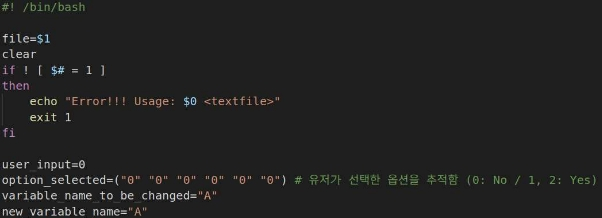

사용자가 인자로 넘겨준 파일($1)을 file 변수에 저장합니다. 

만일 넘겨준 인자가 1개가 아니라면 에러 메시지를 출력하고 프로그램을 종료합 니다. 

user\_input은 메뉴가 출력되고 사용자의 선택을 추적하기 위한 변수입니다. option\_selected는 사용자가 어떤 옵션을 선택했는지 추적하기 위한 배열입니다. 

Variable\_name\_to\_be\_changed와 new\_variable\_name은 파일 내부의 변수명 변경 시 사용되는 변수입니다. 

Print Menu 

1~8의 옵션을 유저로부터 입력받음, 만일 1~8 범위의 숫자를 입력하지 않으면 에러 메시지를 출력, 그 후 다시 메뉴를 출력함 

아래는 함수의 내부 구현부 입니다. 

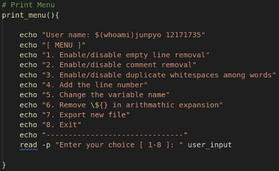

옵션들을 출력해 주고 사용자로부터 전역변수 user\_input 을 입력 받습니다. 

그 후 종료를 의미하는 8 번을 입력받을 때까지 후술할 작업들을 반복합니다. 실제 작업은 옵션 7 번에서 최종결정하기 전에는 반영되지 않습니다. 

1. Enable/disable empty line removal 

사용자가 옵션 1번을 선택 

그 후 y 또는 Y를 입력하면 option\_selected 배열의 0번 인덱스가 1로 세팅됩니 다.  

(후술할 옵션들 중 4번 5번 옵션을 제외하면 아래사진과 다른점이 없기에 이후에 는 생략하도록 하겠습니다.) 

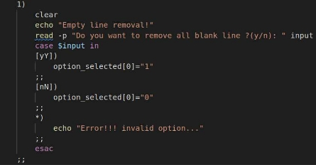

유저가 7번 옵션으로 변경사항을 반영하면, 아래 함수가 실행됩니다. 

Sed -i 옵션으로 변경사항을 바로 파일에 저장합니다, 

표현식은 라인의 시작부분부터 끝부분까지 공백문자로 이뤄진 라인 또는 ‘\n’만 존재하는 라인을 제거합니다. 

아래는 테스트 파일에 적용된 화면입니다. 

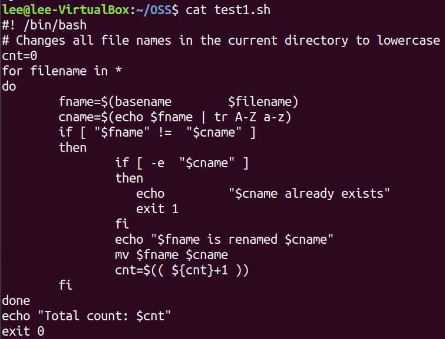

2. Enable/disable comment removal 

사용자가 옵션 2번을 선택 

그 후 y 또는 Y를 입력하면 option\_selected 배열의 1번 인덱스가 1로 세팅됩니 다.  

유저가 7번 옵션으로 변경사항을 반영하면, 아래 함수가 실행됩니다. 

공백이 하나 이상으로 시작되는 comment를 지우는데 Shebang을 지우는 것을 방지하기 위해 ‘#’뒤에 바로 ‘!’오는 것을 제외하도록 했습니다. 

아래는 테스트 파일에 적용된 화면입니다. 

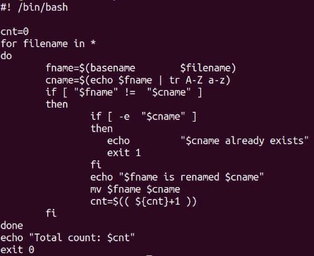

3. Enable/disable duplicate whitespaces 

사용자가 옵션 3번을 선택 

그 후 y 또는 Y를 입력하면 option\_selected 배열의 2번 인덱스가 1로 세팅됩니 다.  

유저가 7번 옵션으로 변경사항을 반영하면, 아래 함수가 실행됩니다. 

-E옵션으로 Extended Regular expression을 사용하도록 하고 

word가 1개 이상 나오고(1번) , 공백이 1개 이상 나온후, 뒤에 나오는 모든 character들을(2번) \1\2형식으로 변경합니다. 

이 출력을 tmpfile의 표준입력에 redirection하고 tmpfile을 mv 명령어로 인자로 주어진 파일에 덮어쓰기 합니다. 

아래는 테스트 파일에 적용된 화면입니다. 

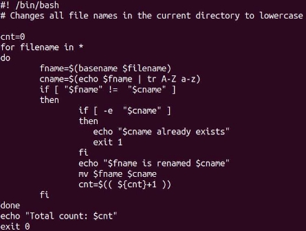

4. Add the line number 

사용자가 옵션 4번을 선택 

그 후 s 또는 S를 입력하면 option\_selected 배열의 3번 인덱스가 1로  

e 또는 E를 입력하면 option\_selected 배열의 3번 인덱스가 2로 세팅됩니다.  

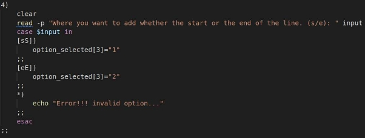

유저가 7번 옵션으로 변경사항을 반영하면, 아래 함수가 실행됩니다. 

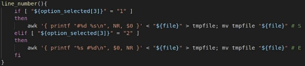

option\_selected[3]의 값이 1이면 라인의 시작에 라인번호를 삽입한다는 뜻이고 printf 함수를 사용하여 ‘#’NR, 공백, string의 순서대로 출력하게 하였습니다.  option\_selected[3]의 값이 2이면 라인의 끝에 라인번호를 삽입한다는 뜻이고 printf 함수를 사용하여 string, 공백, ‘#’NR 의 순서대로 출력하게 하였습니다.  

이 출력을 tmpfile의 표준입력에 redirection하고 tmpfile을 mv 명령어로 인자로 주어진 파일에 덮어쓰기 합니다. 

아래는 테스트 파일에 적용된 화면입니다. 

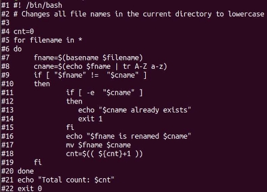

5. Change the variable name 

사용자가 옵션 5번을 선택 

그 후 기존의 변수명과 새로운 변수명을 입력합니다. 

존재하는 변수 명이라면 option\_selected 배열의 4번 인덱스가 1로 세팅됩니다.  +  추가사항

만일 파일에 존재하지 않는 변수명을 입력한다면 

에러메세지를 출력합니다. 

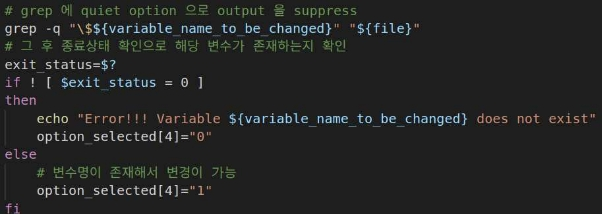

이는 grep 명령어에 -q 옵션으로 출력을 억제한 뒤  종료상태를 확인하는 방식으로 구현했습니다. 

유저가 7 번 옵션으로 변경사항을 반영하면, 아래 함수가 실행됩니다. 

첫번째 줄은 lvalue에 존재하는 변수를 찾아서 새로운 변수명으로 바꿔주는 코드 이고 

두번째 줄은 ‘$’뒤의 String을 찾아서 오직 변수만을 변경해주는 코드입니다. 단순 String은 변경되지않습니다. 

아래는 테스트 파일에 적용된 화면입니다. 

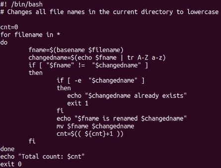

6. Remove ${} in arithmathic expansion 

사용자가 옵션 5번을 선택 

그 후 y 또는 Y를 입력하면 option\_selected 배열의 5번 인덱스가 1로 세팅됩니 다.  

유저가 7번 옵션으로 변경사항을 반영하면, 아래 함수가 실행됩니다. 

Back-reference를 사용했습니다. 

‘$’로 시작하고 ‘(‘이 두번 연속으로 나오는 것을 \1으로 지정 

그 후 ‘$’과 ‘{‘으로 시작, ‘}’의 사이에 있는 모든 문자를 \2으로 지정 

뒤의 나머지 문자들을 \3으로 지정하고 \1, \2, \3 을 공백문자를 두어 저장하 였습니다. 

아래는 테스트 파일에 적용된 화면입니다. 

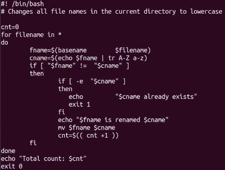

7. Save and Exit 

Save는 상기 과정에서 설명하였으므로 생략하겠습니다. 사용자가 옵션 8번을 선택시 스크립트가 종료됩니다. 

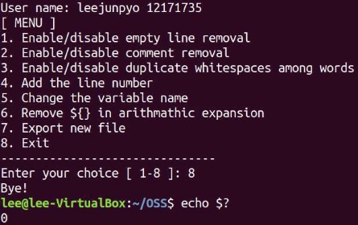

Exit status 0 으로 정상종료됨을 확인하였습니다. 

8. 모든 옵션을 사용 

아래는 1~6 옵션을 테스트 파일에 적용된 화면입니다. 

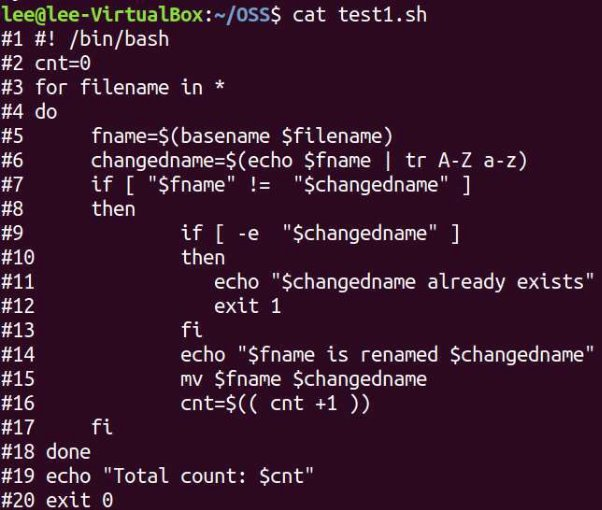
